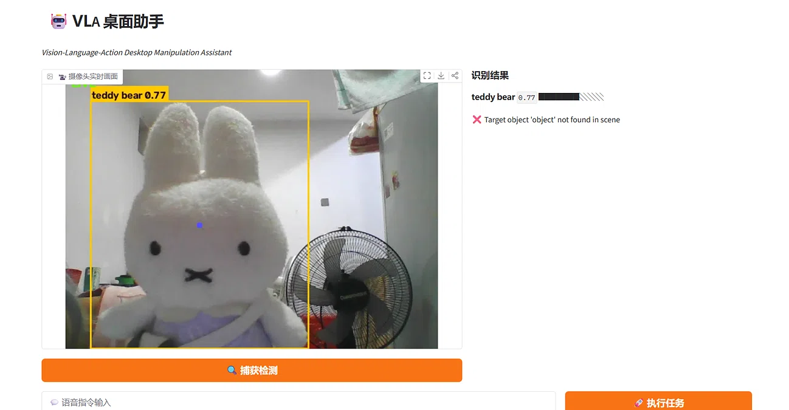
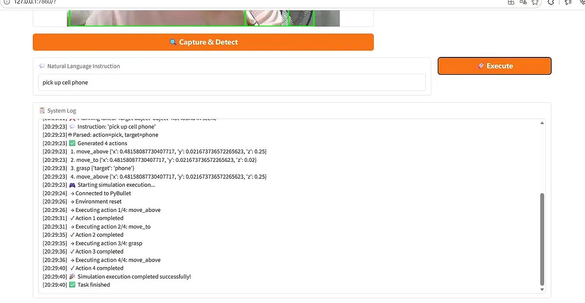
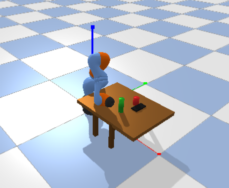
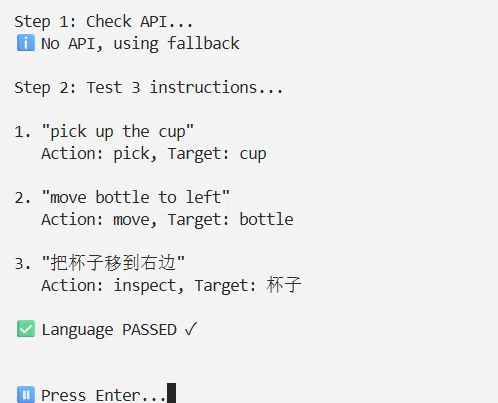

# 🤖 VLA-Desk 桌面助手

<div align="center">

**Vision-Language-Action Desktop Manipulation Assistant**

一个基于视觉-语言-动作的智能桌面机械臂助手系统

[](https://www.python.org/)
[](https://gradio.app/)
[](LICENSE)

[功能特性](#-功能特性) • [快速开始](#-快速开始) • [使用指南](#-使用指南) • [项目结构](#-项目结构) • [技术栈](#-技术栈)

</div>

---

## 📖 项目简介

VLA-Desk 是一个完整的视觉-语言-动作(Vision-Language-Action)机器人系统，将计算机视觉、自然语言处理和机械臂控制无缝集成，实现桌面物体的智能操作。

### 核心亮点

- 🎥 **实时视觉检测**：基于 YOLOv8 的高精度物体识别
- 💬 **自然语言理解**：支持中英文口语化指令
- 🧠 **智能动作规划**：自动生成机械臂执行序列
- 🤖 **3D 物理仿真**：PyBullet 真实感仿真验证
- 🎨 **现代化界面**：深色科技风 Gradio UI

## 📸 效果预览

### 物体检测界面
摄像头实时识别桌面物体，YOLO 自动标注检测框和置信度。



---

### 指令执行日志
从输入指令到仿真执行的完整日志记录。



---

### 仿真执行截图
PyBullet 环境中 UR5 机械臂执行抓取动作。



---

### 语言模块测试
规则解析器对中英文指令的解析结果。




> 💡 提示：运行 `python app.py` 后访问网址查看完整界面

## ✨ 功能特性

### 视觉感知模块
- ✅ YOLOv8 实时物体检测
- ✅ 支持多类常见桌面物体（杯子、笔、键盘、手机等）
- ✅ 中文标签自动翻译
- ✅ 置信度可视化进度条
- ✅ 像素坐标到世界坐标自动转换

### 语言理解模块
- ✅ 自然语言指令解析（支持 LLM API）
- ✅ 内置规则解析器（无需 API 即可使用）
- ✅ 支持中英文双语指令
- ✅ 智能降级机制（API 失败自动切换）
- ✅ 支持 pick, move, place 等多种动作

### 动作规划模块
- ✅ 自动生成完整机械臂动作序列
- ✅ 智能路径规划（避障、安全高度）
- ✅ 支持 pick-and-place 完整流程
- ✅ 坐标系统自动转换

### 仿真验证模块
- ✅ PyBullet 物理引擎集成
- ✅ KUKA iiwa 机械臂模型
- ✅ 逆运动学自动求解
- ✅ 实时可视化执行过程

### 交互界面
- ✅ 深色科技风主题设计
- ✅ 实时摄像头画面显示
- ✅ 检测结果实时更新
- ✅ 预设指令快捷按钮
- ✅ 完整系统日志记录

## 🚀 快速开始

### 环境要求

- Python 3.10 或更高版本
- 摄像头（可选，用于实时检测）
- Windows / Linux / MacOS

### 安装步骤

1. **克隆项目**
   ```bash
   git clone https://github.com/xuu-2/VLA-Desk.git
   cd VLA-Desk
   ```

2. **安装依赖**
   ```bash
   pip install -r requirements.txt
   ```

3. **配置 API Key**
   
   如果需要使用 LLM 增强的语言理解功能：
   
   ```bash
   cp .env.example .env
   # 编辑 .env 文件，填入你的 API Key
   ```
   
   **注意**：即使不配置 API Key，系统也能正常运行（使用内置规则解析器）

4. **启动应用**
   ```bash
   python app.py
   ```

5. **访问界面**
   
   浏览器打开：http://127.0.0.1:7860

## 🎯 使用指南

### 基本流程

1. **点击「🔍 捕获检测」** - 获取摄像头画面并检测物体
2. **输入自然语言指令** - 例如："拿起杯子"
3. **点击「🚀 执行任务」** - 系统自动生成并显示执行计划

### 支持的指令示例

| 中文指令 | 英文指令 | 动作类型 |
|---------|---------|---------|
| 拿起杯子 | pick up the cup | pick |
| 把笔移到左边 | move the pen to the left | move |
| 将手机放在键盘上 | place the phone on the keyboard | place |

### 预设快捷指令

界面底部提供常用指令按钮，一键填充指令框：
- 拿起杯子
- 移动瓶子到左边
- 把笔放到杯子里

## 📁 项目结构

```
VLA-Desk/
├── app.py                      # Gradio UI 主程序
├── requirements.txt            # 项目依赖
├── .env.example                # API 配置模板
├── .gitignore                  # Git 忽略文件
│
├── perception/                 # 视觉模块
│   ├── __init__.py
│   └── yolo_detector.py        # YOLO 检测器
│
├── language/                   # 语言模块
│   ├── __init__.py
│   └── llm_planner.py          # 指令解析器
│
├── planning/                   # 规划模块
│   ├── __init__.py
│   └── action_planner.py       # 动作规划器
│
├── simulation/                 # 仿真模块
│   ├── __init__.py
│   └── pybullet_env.py         # PyBullet 环境
│
├── robot/                      # 机器人控制
│   ├── __init__.py
│   └── arm_controller.py       # 机械臂控制器
│
├── demo/                       # 演示脚本
│   └── demo.py                 # 端到端演示
│
└── tests/                      # 测试脚本
    ├── test_pipeline.py        # 完整流程测试
    ├── test_vision.py          # 视觉模块测试
    ├── test_language.py        # 语言模块测试
    ├── test_planning.py        # 规划模块测试
    └── test_webcam.py          # 实时摄像头测试
```

## 🧪 测试模块

### 完整流程测试
```bash
python test_pipeline.py
```

### 单独模块测试
```bash
python test_vision.py      # 测试视觉检测
python test_language.py    # 测试语言解析
python test_planning.py    # 测试动作规划
python test_webcam.py      # 测试实时检测
```

### 仿真环境测试
```bash
python simulation/pybullet_env.py
```

## ⚙️ 配置说明

### 视觉检测参数

在 `perception/yolo_detector.py` 中调整：

```python
detector = YOLODetector(
    model_path="yolov8n.pt",
    confidence_threshold=0.45  # 置信度阈值 (0.0-1.0)
)
```

### 动作规划参数

在 `planning/action_planner.py` 中调整：

```python
planner = ActionPlanner(
    safe_height=0.25,      # 安全高度（米）
    grasp_height=0.02,     # 抓取高度（米）
    image_width=640,       # 图像宽度（像素）
    image_height=480       # 图像高度（像素）
)
```

### LLM API 配置（可选）

支持任何 OpenAI API 兼容的服务：

```python
planner = LLMPlanner(
    api_key="your-api-key",
    model_name="deepseek-ai/DeepSeek-V3",
    base_url="https://api.siliconflow.cn/v1"
)
```

## 🔧 常见问题

<details>
<summary><b>Q: 摄像头无法打开怎么办？</b></summary>

**A**: 
1. 检查摄像头是否被其他程序占用
2. 尝试更改摄像头索引（0 → 1）
3. 使用测试图片代替摄像头输入
</details>

<details>
<summary><b>Q: 检测不到物体怎么办？</b></summary>

**A**: 
1. 调低置信度阈值（0.45 → 0.3）
2. 确保物体在 COCO 数据集类别中
3. 检查光线是否充足
4. 物体尽量完整出现在画面中
</details>

<details>
<summary><b>Q: 不配置 API Key 能用吗？</b></summary>

**A**: 
完全可以！系统内置规则解析器，支持常见指令的解析，无需 API Key 也能正常运行。
</details>

<details>
<summary><b>Q: 仿真窗口弹不出来？</b></summary>

**A**: 
1. 确保已安装 PyBullet：`pip install pybullet`
2. 检查是否有显示器连接（远程服务器需要配置虚拟显示）
3. 尝试设置 `gui=False` 使用无头模式
4. Windows 用户检查防火墙是否拦截
</details>

<details>
<summary><b>Q: 如何提升检测速度？</b></summary>

**A**: 
1. 使用 YOLOv8n（最小最快的模型）
2. 降低图像分辨率
3. 使用 GPU 加速（需安装 CUDA 版 PyTorch）
</details>

## 📊 技术栈

| 领域 | 技术 |
|------|------|
| 视觉 | YOLOv8, OpenCV |
| 语言 | LLM API / 规则解析器 |
| 规划 | 自定义算法 + IK 求解 |
| 仿真 | PyBullet |
| 界面 | Gradio 4.x |
| 环境 | python-dotenv |

## 🎨 界面预览

### 深色科技风主题
- 背景：深蓝/紫灰渐变
- 主色调：#00c8ff 科技蓝
- 毛玻璃卡片效果
- 平滑动画过渡

### 主要功能区
- **左侧**：实时摄像头画面 + YOLO 检测框
- **右上**：识别结果列表（中文标签 + 置信度条）
- **右中**：语言助手执行计划
- **右下**：系统状态实时更新
- **底部**：指令输入 + 快捷按钮 + 系统日志

## 🌟 未来计划

- [ ] 支持更多机械臂模型（UR5, Franka Panda）
- [ ] 真实机械臂硬件接口
- [ ] 语音输入功能
- [ ] 多物体协同操作
- [ ] 实时视频流处理
- [ ] 移动端适配

## 🤝 贡献指南

欢迎提交 Issue 和 Pull Request！

1. Fork 本项目
2. 创建特性分支 (`git checkout -b feature/AmazingFeature`)
3. 提交更改 (`git commit -m 'Add some AmazingFeature'`)
4. 推送到分支 (`git push origin feature/AmazingFeature`)
5. 开启 Pull Request

## 📄 开源协议

本项目采用 [MIT License](LICENSE) 开源协议。

## 📧 联系方式

如有问题或建议，欢迎通过 [GitHub Issues](https://github.com/xuu-2/VLA-Desk/issues) 联系。

## 🙏 致谢

感谢以下开源项目：

- [YOLOv8](https://github.com/ultralytics/ultralytics) - 物体检测
- [Gradio](https://github.com/gradio-app/gradio) - Web UI 框架
- [PyBullet](https://pybullet.org/) - 物理仿真引擎

---

<div align="center">

**VLA-Desk** - 让桌面机械臂更智能 🤖✨

Made with ❤️ by [xuu-2](https://github.com/xuu-2)

⭐ 如果这个项目对你有帮助，请给个 Star！

</div>
